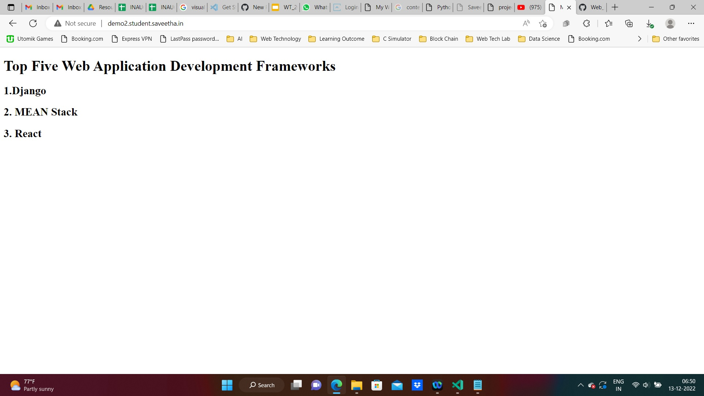

# Developing a Simple Webserver
Name: vinodhini 
ref: 23013556

# AIM:

Develop a webserver to display about top five web application development frameworks.

# DESIGN STEPS:

## Step 1:

HTML content creation is done

## Step 2:

Design of webserver workflow

## Step 3:

Implementation using Python code

## Step 4:

Serving the HTML pages.

## Step 5:

Testing the webserver
# PROGRAM:
``````
from http.server import HTTPserver,baseHTTPrequesthandler
content="""
<html>
<head>
</head>
<body>
<h1>welcome</h1>
</body>
</html>
"""
class hellohandler(baseHTTPRequesthandler):
        def do_GET(self):
             self.send_respons(200)
             self.send_header('content-type', 'text/html; charset=utf-8')
             self.end_headers()
             self.wfile.write(content.encode())


server_address = ('',80)
httpd=HTTPserver(server_address, hellohandler)
httpd.server_forever()
```````
# OUTPUT:

# RESULT:

The program is executed succesfully
